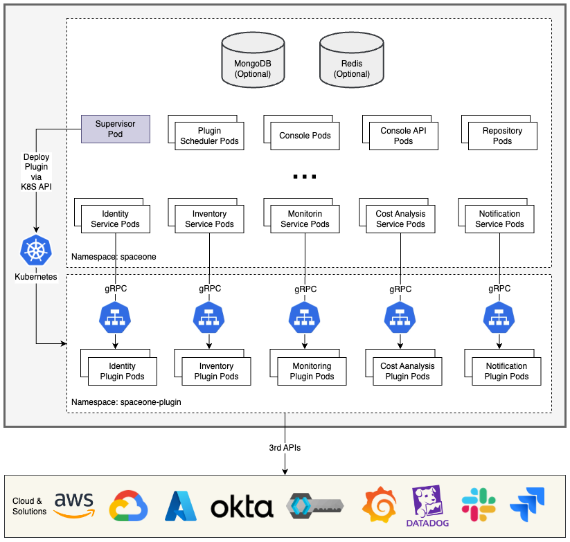

# Cloudforet Helm Charts 
A Helm Chart for Cloudforet `1.11.5`.

## Prerequisites
- Kubernetes 1.21+
- Helm 3.2.0+
- Service Domain & SSL Certificate (optional)
  - Console: `*.console.example.com`
  - REST API: `*.api.example.com`
  - gRPC API: `*.grpc.example.com`
  - Webhook: `webhook.example.com`
- MongoDB 5.0+ (optional)

### Cloudforet Architecture


### Docker Images
You can download the docker images from [Docker Hub](https://hub.docker.com/u/spaceone).

| Image Name                  | Version             | Required |
|:----------------------------|:--------------------|:--------:|
| spaceone/console            | 1.11.0.27           |    O     |
| spaceone/console-api        | 1.11.0.4            |    O     |
| spaceone/identity           | 1.11.0              |    O     |
| spaceone/secret             | 1.11.0              |    O     |
| spaceone/repository         | 1.11.0.2            |    O     |
| spaceone/plugin             | 1.11.0              |    O     |
| spaceone/config             | 1.11.0              |    O     |
| spaceone/inventory          | 1.11.0.3            |    O     |
| spaceone/monitoring         | 1.11.0.3            |    O     |
| spaceone/statistics         | 1.11.0              |    O     |
| spaceone/cost-analysis      | 1.11.0.3            |    O     |
| spaceone/notification       | 1.11.0              |    O     |
| spaceone/board              | 1.11.0              |    O     |
| spaceone/file-manager       | 1.11.0              |    O     |
| spaceone/dashboard          | 1.11.0.4            |    O     |
| spaceone/console-api-v2     | 1.11.0.2            |    O     |
| spaceone/supervisor         | 1.11.0.4            |    O     |
| spaceone/spacectl           | 1.11.0.12           |    O     |
| spaceone/marketplace-assets | 1.11.0.1            |    X     |
| spaceone/docs               | 0.1.20230502.153847 |    X     |
| mongo                       | latest              |    X     |
| redis                       | latest              |    X     |

> If your Kubernetes cluster can't access the internet, you need to download the docker images and push them to your private docker registry.


## Installation
You can install the Cloudforet using the following the steps.

### 1) Add Helm Repository
```bash
helm repo add cloudforet https://cloudforet-io.github.io/charts
helm repo update
helm search repo
```

### 2) Create Namespaces
```bash
kubectl create ns spaceone
kubectl create ns spaceone-plugin
```
If you want to use only one namespace, you don't create the `spaceone-plugin` namespace.

### 3) Create Role and RoleBinding
First, download the [rbac.yaml](examples/rbac.yaml) file and execute the following command.

```bash
kubectl apply -f rbac.yaml -n spaceone-plugin
```

### 4) Install Cloudforet Chart
```bash
helm install cloudforet cloudforet/spaceone -n spaceone
```

After executing the above command, check the status of the pod.
```bash
kubectl get pod -n spaceone

NAME                                      READY   STATUS             RESTARTS      AGE
board-5746fd9657-vtd45                    1/1     Running            0             57s
config-5d4c4b7f58-z8k9q                   1/1     Running            0             58s
console-6b64cf66cb-q8v54                  1/1     Running            0             59s
console-api-7c95848cb8-sgt56              2/2     Running            0             58s
console-api-v2-rest-7d64bc85dd-987zn      2/2     Running            0             56s
cost-analysis-7b9d64b944-xw9qg            1/1     Running            0             59s
cost-analysis-scheduler-ff8cc758d-lfx4n   0/1     Error              3 (37s ago)   55s
cost-analysis-worker-559b4799b9-fxmxj     1/1     Running            0             58s
cost-analysis-worker-559b4799b9-nf5vs     1/1     Running            0             58s
cost-analysis-worker-559b4799b9-swzw8     1/1     Running            0             58s
cost-analysis-worker-559b4799b9-x8f4j     1/1     Running            0             58s
dashboard-b4cc996-mgwj9                   1/1     Running            0             56s
docs-5fb4cc56c7-68qbk                     1/1     Running            0             59s
identity-6fc984459d-zk8r9                 1/1     Running            0             56s
inventory-67498999d6-722bw                1/1     Running            0             57s
inventory-scheduler-5dc6856d44-4spvm      0/1     CrashLoopBackOff   3 (18s ago)   59s
inventory-worker-68d9fcf5fb-x6knb         1/1     Running            0             55s
marketplace-assets-8675d44557-ssm92       1/1     Running            0             59s
mongodb-7c9794854-cdmwj                   1/1     Running            0             59s
monitoring-fdd44bdbf-pcgln                1/1     Running            0             59s
notification-5b477f6c49-gzfl8             1/1     Running            0             59s
notification-scheduler-675696467-gn24j    1/1     Running            0             59s
notification-worker-d88bb6df6-pjtmn       1/1     Running            0             57s
plugin-556f7bc49b-qmwln                   1/1     Running            0             57s
plugin-scheduler-86c4c56d84-cmrmn         0/1     CrashLoopBackOff   3 (13s ago)   59s
plugin-worker-57986dfdd6-v9vqg            1/1     Running            0             58s
redis-75df77f7d4-lwvvw                    1/1     Running            0             59s
repository-5f5b7b5cdc-lnjkl               1/1     Running            0             57s
secret-77ffdf8c9d-48k46                   1/1     Running            0             55s
spacectl-5664788d5d-dtwpr                 1/1     Running            0             59s
statistics-67b77b6654-p9wcb               1/1     Running            0             56s
statistics-scheduler-586875947c-8zfqg     0/1     Error              3 (30s ago)   56s
statistics-worker-68d646fc7-knbdr         1/1     Running            0             58s
supervisor-scheduler-6744657cb6-tpf78     2/2     Running            0             59s
```

> Scheduler pods are in `CrashLoopBackOff` or `Error` state. This is because the setup is not complete.

### 5) Initialize the Configuration  
First, download the [initializer.yaml](examples/initializer.yaml) file and execute the following command.
```bash
helm install initializer cloudforet/spaceone-initializer -n spaceone -f initializer.yaml
```

For more information about the initializer, please refer the [spaceone-initializer](https://github.com/cloudforet-io/spaceone-initializer).

### 6) Set the Helm Values and Upgrade the Chart
Complete the initialization, you can get the system token from the initializer pod logs.
```bash
kubectl logs initializer-5f5b7b5cdc-lnjkl -n spaceone

...
TASK [Print Admin API Key] *********************************************************************************************
"{TOKEN}"

FINISHED [ ok=23, skipped=0 ] ******************************************************************************************

FINISH SPACEONE INITIALIZE
```

Create the `values.yaml` file and edit the values.
```yaml
console:
    production_json:
        # If you don't have a service domain, you refer to the following 'No Domain & IP Access' example.
        CONSOLE_API:
            ENDPOINT: https://console.api.example.com       # Change the endpoint
        CONSOLE_API_V2:
            ENDPOINT: https://console-v2.api.example.com    # Change the endpoint

global:
    shared_conf:
        TOKEN: '{TOKEN}'                                    # Change the system token
```

For more advanced configuration, please refer the following the links.
- Documents
  - [Parameters](docs/parameters.md)
- Examples
  - [All Values](examples/values/all.yaml)
  - Infra & Kubernetes
    - [Change Pod Replica](examples/values/change_pod_replica_values.yaml)
    - [Node Selector](examples/values/node_selector_values.yaml)
    - [Change Namespace](examples/values/change_namespace_values.yaml)
    - [One Namespace](examples/values/one_namespace_values.yaml)
    - Set Private Docker Registry
    - Set HTTP Proxy
    - Set Container Resource Request & Limit
  - Application
    - [Set External Database](examples/values/external_db_values.yaml)
    - [Change Database Name](examples/values/change_db_name_values.yaml)
    - Multi-Tenant Mode
    - Enable Monitoring Webhook & Notification
    - Change Secret Storage
    - Set Private Assets & Docs

After editing the `values.yaml` file, upgrade the helm chart.
```bash
helm upgrade cloudforet cloudforet/spaceone -n spaceone -f values.yaml
kubectl delete po -n spaceone -l app.kubernetes.io/instance=cloudforet
```

### 7) Check the status of the pods
```bash
kubectl get pod -n spaceone
```

If all pods are in `Running` state, the setup is complete.

### 8) Configure Ingress
After the installation, you need to configure the ingress to access the console and API.

- [AWS](docs/ingress/aws.md)
- [On-premise](docs/ingress/on_premise.md)
- [Port Forwarding (No Ingress)](docs/ingress/port_forwarding.md)

## Upgrade
You can upgrade the cloudforet from the previous version.

### 1) Upgrade the Helm Chart
```bash
helm repo update
helm upgrade cloudforet cloudforet/spaceone -n spaceone -f values.yaml
kubectl delete po -n spaceone -l app.kubernetes.io/instance=cloudforet
```
## Uninstall
You can uninstall the cloudforet with the following command.

### 1) Delete the Helm Chart
```bash
helm delete cloudforet -n spaceone
helm delete cloudforet-initializer -n spaceone
```

### 2) Delete the Ingress
```bash
kubectl delete ingress --all -n spaceone
```

### 4) Delete all plugins
```bash
kubectl delete deployment --all -n spaceone-plugin
kubectl delete service --all -n spaceone-plugin
```

### 5) Delete cloudforet namespaces
```bash
kubectl delete namespace spaceone
kubectl delete namespace spaceone-plugin
```